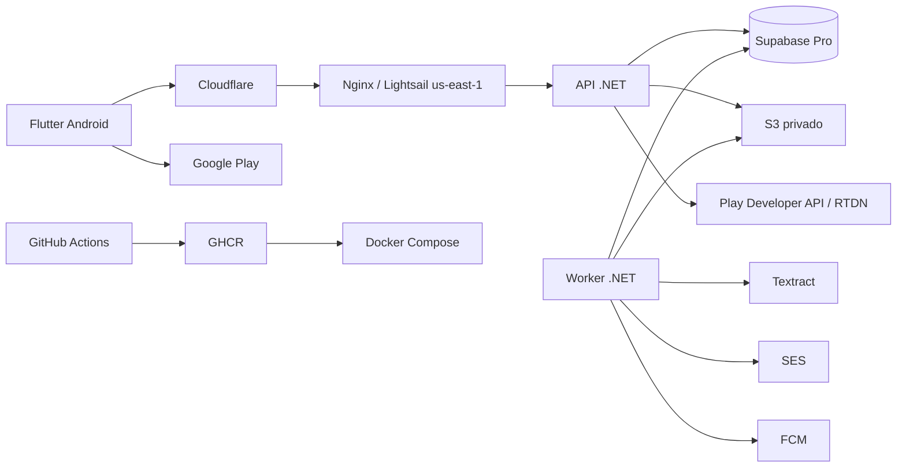

# Factibilidad y arquitectura ejecutable del piloto

**Validación:** 30 de julio de 2026  
**Región de trabajo:** North Virginia (`us-east-1`)

## Resultado

La arquitectura es aplicable con servicios comerciales reales. La decisión regional es
importante: Amazon Textract no ofrece endpoint en São Paulo, por lo que mantener cómputo,
S3, Textract y SES en `us-east-1` evita tráfico interregional, costos y una topología más
difícil de explicar. Es una arquitectura de piloto para diez participantes, no alta
disponibilidad.

| Capacidad | Decisión ejecutable | Confirmación |
|---|---|---|
| Aplicación | Flutter Android, Internal Testing | Google Play admite hasta 100 testers internos |
| Compra de prueba | Play Billing + Developer API + RTDN | License testers permiten probar sin cobro real |
| Push/crashes | FCM + Crashlytics | Ambos están disponibles sin costo en el plan Spark |
| API/Worker | .NET 10 en Docker Compose | Una VM es suficiente para la carga objetivo |
| Cómputo | Lightsail Ubuntu, North Virginia | Región disponible, precio mensual predecible |
| Base | Supabase Pro North Virginia | Backup diario; usar roles separados y TLS VerifyFull |
| Documentos | S3 privado `us-east-1` | URL prefirmada, cifrado y política IAM mínima |
| OCR | Textract AnalyzeExpense `us-east-1` | Español soportado para detección; Queries sólo inglés |
| Correo | SES `us-east-1` | Hay que verificar remitente y solicitar salida del sandbox |
| Borde | Cloudflare Free + Nginx | TLS de extremo a extremo en modo Full (strict) |
| Entrega | GitHub Actions + GHCR + Environment `pilot` | Imágenes inmutables y aprobación antes de desplegar |

Fuentes oficiales:

- [Regiones de Lightsail](https://docs.aws.amazon.com/lightsail/latest/userguide/understanding-regions-and-availability-zones-in-amazon-lightsail.html)
- [Regiones y endpoints de Textract](https://docs.aws.amazon.com/general/latest/gr/textract.html)
- [Límites e idiomas de Textract](https://docs.aws.amazon.com/textract/latest/dg/limits-document.html)
- [Conexiones seguras de Supabase](https://supabase.com/docs/guides/database/connecting-to-postgres)
- [Backups de Supabase](https://supabase.com/docs/guides/platform/backups)
- [Sandbox de SES](https://docs.aws.amazon.com/ses/latest/dg/request-production-access.html)
- [Precios y plan Firebase](https://firebase.google.com/docs/projects/billing/firebase-pricing-plans)
- [Google Play Internal Testing](https://support.google.com/googleplay/android-developer/answer/9845334)
- [Certificados universales Cloudflare](https://developers.cloudflare.com/ssl/edge-certificates/universal-ssl/)

## Topología

## Decisiones de reducción de riesgo

- Supabase se utiliza sólo como PostgreSQL administrado; Flutter no recibe credenciales.
- API y Worker usan roles distintos mediante Supavisor session mode. El migrador y
  `pg_dump` usan conexión directa y certificado raíz.
- Redis se difiere: con diez usuarios, outbox y trabajos durables en PostgreSQL ya cubren
  consistencia y reintentos. Se añade sólo si las métricas prueban un cuello de botella.
- MinIO no forma parte de producción. El adaptador local se usa para desarrollo y S3 para
  el piloto.
- El bucket no es público. La API genera URLs de lectura temporales y el Worker procesa
  OCR con una identidad IAM limitada.
- Nginx es la única entrada. Los puertos de API y Worker no se publican.
- Supabase aporta backup diario y, adicionalmente, `pg_dump` crea una copia cifrada en un
  bucket separado. La restauración se ensaya fuera de producción.

## Qué queda fuera del código

No es posible crear desde el repositorio las cuentas ni aceptar costos. El responsable
debe contratar Lightsail/Supabase Pro, controlar el dominio, completar verificaciones de
AWS/Google, cargar secretos y aprobar el despliegue del Environment `pilot`.
